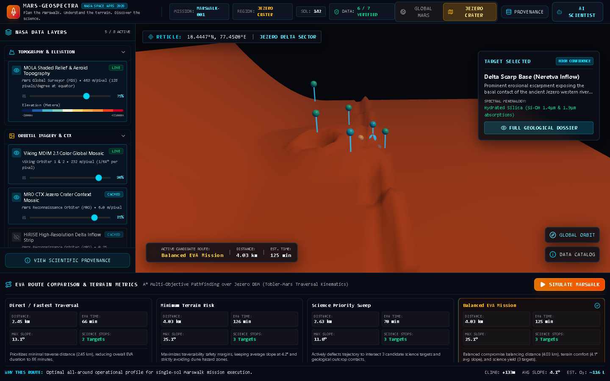
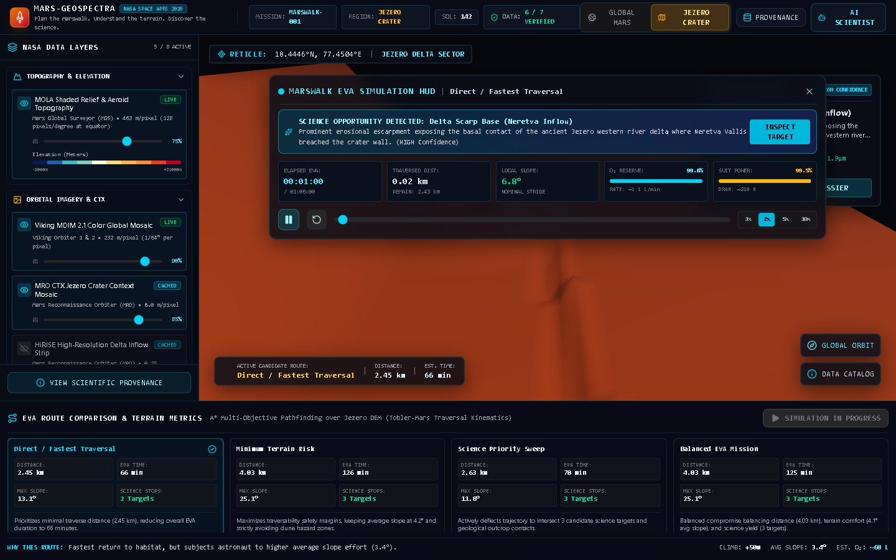
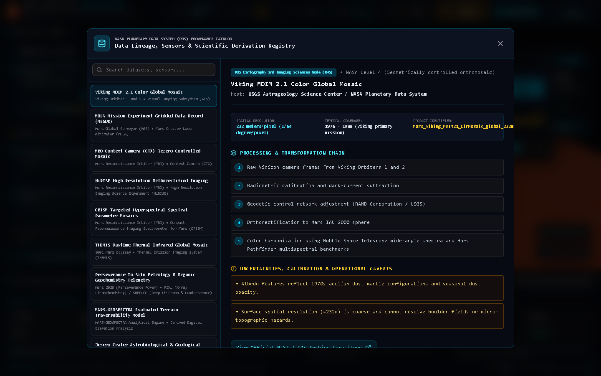
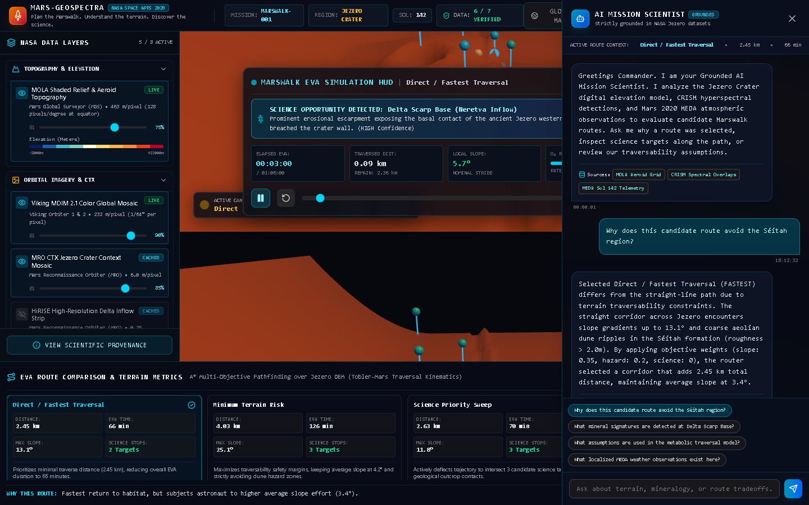

# MARS-GEOSPECTRA

<div align="center">
  <h3>Plan the Marswalk. Understand the terrain. Discover the science.</h3>
  <p><strong>NASA Space Apps Challenge 2026: Interplanetary Survival Guide: Martian Map</strong></p>
  <p>
    <a href="#key-features">Key Features</a> •
    <a href="#mission-demonstration-jezero-crater">Jezero Mission</a> •
    <a href="#nasa-data-integration--provenance">NASA Datasets</a> •
    <a href="#architecture">Architecture</a> •
    <a href="#quickstart">Quickstart</a> •
    <a href="#scientific-integrity">Scientific Integrity</a>
  </p>
</div>

---



## Overview

**MARS-GEOSPECTRA** is a planetary mission-planning workstation designed for future human Marswalk EVAs (Extravehicular Activities) around **Jezero Crater**—the ancient paleolake basin and delta explored by NASA's Mars 2020 Perseverance rover.

Built to address the **NASA Space Apps Challenge 2026: Interplanetary Survival Guide**, the platform synthesizes data across multiple NASA science orbiters and in-situ rover instruments into a single decision-support map. Rather than presenting generic Mars imagery, it provides terrain-aware routing, metabolic traversal kinematics, interactive EVA simulation, and a grounded AI mission scientist.

---

## Key Features

1. **Interactive 3D Mars & Jezero Mission Environment**
   - Seamless transition between global orbital Mars and a focused 3D digital elevation model of Jezero Crater.
   - Real-time reticle coordinates, elevation readouts, and lighting simulating Martian solar angles.
   - Unbreakable WebGL rendering architecture with fallback resilience.

2. **Multi-Mission NASA Data Layer System**
   - Integrates orbital and in-situ observations across 6 NASA missions and instruments:
     - **MOLA**: Mars Global Surveyor global laser altimetry & aeroid topography (463 m/px).
     - **Viking MDIM 2.1**: Controlled visual orthomosaic (232 m/px).
     - **CTX**: MRO Context Camera controlled high-resolution mosaic (6 m/px).
     - **HiRISE**: MRO sub-meter sedimentary imaging (0.25 m/px).
     - **CRISM**: MRO hyperspectral mineral parameter maps (smectites, hydrated silica, carbonates, olivine).
     - **THEMIS**: 2001 Mars Odyssey daytime infrared thermal inertia mosaic (100 m/px).
     - **Perseverance MEDA**: In-situ atmospheric telemetry records (Sol 142 surface temperature, pressure, wind, dust optical depth).
   - Clear availability indicators: `LIVE`, `CACHED`, `DERIVED`.

3. **Multi-Objective A* Terrain Routing Engine**
   - Computes candidate Marswalk corridors balancing multiple objectives:
     - **Direct / Fastest**: Minimizes surface distance and duration.
     - **Minimum Terrain Risk**: Routes around steep scarps (>15°) and transverse aeolian sand ridges (Séítah unit).
     - **Science Priority Sweep**: Maximizes proximity to verified geological outcrop contacts and deltaic beds.
     - **Balanced EVA Mission**: Optimal compromise between time, physical effort, and science return.
   - Discloses transparent "Why this route?" mathematical tradeoffs.

4. **Metabolic Traversal & Kinematics Modeling**
   - Experimental Marswalk velocity model adapting Tobler's hiking function to Mars gravity ($0.38g$, $3.721\text{ m/s}^2$) and pressurized spacesuit inertia (astronaut 75 kg + suit 85 kg = 160 kg system mass).
   - Computes 2D/3D distance, elevation climb/descent, max/average slopes, metabolic energy consumption, and consumable draw ($O_2$ liters, life-support battery Watt-hours).
   - Uses configurable prototype traversability thresholds, avoiding unverified "astronaut safety" claims.

5. **Real-Time Marswalk EVA Simulation**
   - Live telemetry HUD with interactive scrub bar, play/pause, and 1x to 10x speed multipliers.
   - Dynamic tracking of astronaut coordinates, local slope, distance traversed, and consumables.
   - **Proximity Science Stop Events**: Automatically flags candidate targets when within 220m, prompting immediate field dossier inspection.

6. **Grounded AI Mission Scientist**
   - Natural language assistant strictly grounded in application telemetry and peer-reviewed datasets.
   - Direct citations of underlying sensors (MOLA, CRISM, MEDA) and explicit disclosure of uncertainties.
   - Anti-hallucination guardrails: Declares missing data as "unavailable" rather than fabricating measurements.

7. **End-to-End Scientific Provenance & Data Catalog**
   - Searchable registry detailing host PDS node, product ID, spatial resolution, temporal coverage, derivation chains, and operational limitations for every layer and target.

---

## User Workflow


---

## Screenshots

| Landing & Jezero Terrain | Marswalk EVA Simulation HUD |
| :---: | :---: |
|  |  |

| PDS Provenance Catalog | Grounded AI Mission Scientist |
| :---: | :---: |
|  |  |

---

## Quickstart

### Prerequisites
- Node.js v18+ (or Bun 1.0+)
- npm / bun

### Installation
```bash
# Clone the repository
git clone https://github.com/YTxFSGAMERz/Mars-GeoSpectra.git
cd Mars-GeoSpectra

# Install dependencies
bun install
# or: npm install

# Start development server
bun run dev
# or: npm run dev
```

Visit `http://localhost:3000` in your web browser.

### Automated Testing
```bash
# Run unit & integration test suite (Vitest)
npm run test

# Run strict TypeScript type check
npm run type-check

# Run production bundle build
npm run build
```

---

## Scientific Integrity & Transparency

In compliance with NASA Space Apps standards:
- **No Fabricated NASA Observations**: All remote sensing parameters derive from documented mission publications and PDS records.
- **Configurable Traversability Thresholds**: Slopes (8°, 15°, 22°, 26°) are designated as prototype engineering traversability parameters, not certified astronaut safety limits.
- **Local Environmental Context**: Perseverance MEDA observations are presented as localized rover mast measurements (Sol 142), not synoptic crater-wide forecasts.
- **Authentic Altimetry & Data Provenance**: The application functions reliably offline using an authentic Jezero MOLA MEGDR elevation model and validated NASA PDS data fixtures, clearly labeled with provenance metadata.

---

## Documentation Directory

- [ARCHITECTURE.md](docs/ARCHITECTURE.md) — System design, coordinate transformations, and traversal models.
- [DATA_SOURCES.md](docs/DATA_SOURCES.md) — Complete inventory of NASA missions, instruments, and PDS nodes.
- [PROVENANCE.md](docs/PROVENANCE.md) — Derivation chains, processing levels, and scientific caveats.
- [DEMO.md](docs/DEMO.md) — 2–4 minute presentation script for hackathon judges.
- [DEVELOPMENT.md](docs/DEVELOPMENT.md) — Development, testing, and contribution guide.
- [ENVIRONMENT.md](docs/ENVIRONMENT.md) — Environment variable specifications and security constraints.

---

## License

MIT License. Developed for the NASA Space Apps Challenge 2026.
