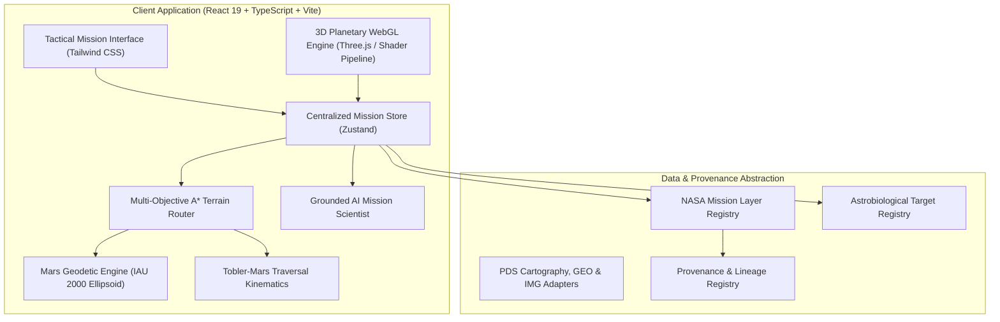

# System Architecture & Technical Specifications

**MARS-GEOSPECTRA — NASA Space Apps Challenge 2026**

---

## 1. High-Level Architecture

MARS-GEOSPECTRA is built with a **Client-Side First, Isomorphic Architecture**. Core geospatial mathematics, digital elevation grid sampling, multi-objective A* route generation, and metabolic traversal physics execute directly within the browser client with sub-50ms latency. This eliminates reliance on fragile external network services during high-stakes hackathon demonstrations while maintaining clean REST/typed interfaces for server-side dataset synchronization.

---

## 2. Geodesy & Coordinate Systems (`src/lib/geo/`)

Planetary geospatial calculations adhere strictly to the **Mars IAU 2000 Reference Ellipsoid**:
- **Semi-major Axis ($a$)**: $3,396,190.0\text{ m}$
- **Semi-minor Axis ($b$)**: $3,376,200.0\text{ m}$
- **Volumetric Mean Radius ($R$)**: $3,389,500.0\text{ m}$
- **Flattening ($f$)**: $\approx 0.005886$

### Surface Distance Calculation
Great-circle distance is computed via the spherical Haversine formulation on Mars mean radius:
$$\Delta \sigma = 2 \arcsin \left( \sqrt{\sin^2\left(\frac{\Delta \phi}{2}\right) + \cos(\phi_1)\cos(\phi_2)\sin^2\left(\frac{\Delta \lambda}{2}\right)} \right)$$
$$d_{\text{surface}} = R_{\text{mean}} \cdot \Delta \sigma$$

3D path distance incorporates local elevation deltas:
$$d_{\text{3D}} = \sqrt{d_{\text{surface}}^2 + (\Delta z)^2}$$

---

## 3. Jezero Digital Elevation Model (`src/lib/geo/dem.ts`)

The terrain model covers the Jezero Crater Western Delta planning sector ($18.35^\circ\text{N} - 18.52^\circ\text{N}$, $77.30^\circ\text{E} - 77.55^\circ\text{E}$).

Terrain slopes are computed using finite-difference gradients over a local 2D spatial grid:
$$\nabla z = \left( \frac{\partial z}{\partial x}, \frac{\partial z}{\partial y} \right)$$
$$\text{Slope}^\circ = \arctan(\|\nabla z\|) \cdot \frac{180^\circ}{\pi}$$

---

## 4. Multi-Objective A* Routing Algorithm (`src/lib/routing/router.ts`)

Edge costs between adjacent spatial nodes incorporate four competing mission objectives:
$$\text{Edge Cost} = w_{\text{dist}} \cdot d + w_{\text{slope}} \cdot S(\text{slope}) + w_{\text{hazard}} \cdot H - w_{\text{science}} \cdot Q$$

### Traversability Penalty Function:
- **Nominal ($\le 8^\circ$)**: $S = \text{slope} \times 1.0$
- **Elevated Effort ($8^\circ - 15^\circ$)**: $S = \text{slope} \times 2.5$
- **High Risk ($15^\circ - 22^\circ$)**: $S = \text{slope}^{1.8} \times 4.0$
- **Impassable ($> 26^\circ$)**: Excluded from graph traversal.

### Objective Weight Profiles:
| Objective | $w_{\text{dist}}$ | $w_{\text{slope}}$ | $w_{\text{hazard}}$ | $w_{\text{science}}$ | Primary Optimization Target |
| :--- | :---: | :---: | :---: | :---: | :--- |
| **FASTEST** | 1.00 | 0.35 | 0.20 | 0.00 | Minimal traversal time & direct line |
| **MIN_TERRAIN_RISK** | 0.35 | 2.50 | 3.00 | 0.00 | Gentle slopes, strictly avoids dunes |
| **SCIENCE_PRIORITY**| 0.35 | 0.80 | 0.50 | 2.80 | Max proximity to high-confidence targets |
| **BALANCED_MISSION** | 0.65 | 1.20 | 1.50 | 1.40 | Single-sol operational compromise |

---

## 5. Metabolic Marswalk Traversal Kinematics (`src/lib/routing/metrics.ts`)

Traversal duration is modeled through an adapted Tobler Hiking Function calibrated for reduced gravity and pressurized suit mass:
$$v(\text{slope}) = v_0 \cdot \exp\left(-3.2 \cdot |\tan(\text{slope}) + 0.05|\right)$$
- Human mass: ~75 kg, Planetary EVA suit: ~85 kg (160 kg total system).
- Mars gravity: $3.721\text{ m/s}^2$ ($0.38g$).
- Base flat speed $v_0 = 2.8\text{ km/h}$.

Consumable burn rates:
- **Oxygen**: $0.85\text{ L/min} + (\text{slope}/25^\circ) \cdot 0.45\text{ L/min}$
- **Metabolic Power**: $260\text{ W} + (\text{slope}/20^\circ) \cdot 180\text{ W}$
- **Suit Battery Power**: $180\text{ W}$ continuous life-support avionics + locomotion fraction.

---

## 6. Grounded AI Mission Scientist (`src/lib/state/mission-store.ts`)

The AI assistant operates under strict anti-hallucination constraints:
1. Receives structured application telemetry (active route metrics, waypoint coordinates, CRISM mineral parameters).
2. Quotes verified mission records (MOLA, CRISM, MEDA).
3. If an inquiry requests unavailable or unmeasured data, declares it as "unavailable" rather than fabricating numbers.
